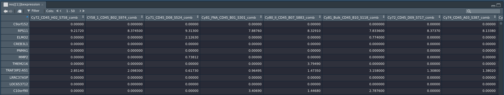

# TMExplorer

### Installation
``` 
> library(devtools)
> install_github("shooshtarilab/TMExplorer")
```
note: while the repo is set to private you will have to generate a personal access token (with repo access) [here](https://github.com/settings/tokens), make sure to save the token somewhere locally and then call:

```
> install_github("shooshtarilab/TMExplorer", auth_token='token')
```

# Tutorial

## Exploring available datasets

Start by exploring the available datasets through metadata.

```
> res = queryTME(metadata_only = TRUE)
```

This will return a list containing a single dataframe of metadata for all available datasets. View the metadata with `View(res[[1]])` and then check `?queryTME` for a description of searchable fields.

Note: in order to keep the function's interface consistent, `queryTME` always returns a list of objects, even if there is only one object. You may prefer running `res = queryTME(metadata_only = TRUE)[[1]]` in order to save the dataframe directly.


The `metatadata_only` argument can be applied alongside any other argument in order to examine only datasets that have certain qualities. You can, for instance, view only breast cancer datasets by using 

```
> res = queryTME(tumour_type = 'Breast cancer', metadata_only = TRUE)[[1]]
```


| Search Parameter | Description                                     | Examples                |
| ---------------- | ----------------------------------------------- | ----------------------- |
| geo_accession    | Search by GEO accession number                  | GSE72056, GSE57872      |
| score_type       | Search by type of score shown in $expression    | TPM, RPKM, FPKM         |
| has_signatures   | Filter by presence of cell-type gene signatures | TRUE, FALSE             |
| has_truth        | Filter by presence of cell-type labels          | TRUE, FALSE             |
| tumour_type      | Search by tumour type                           | Breast cancer, Melanoma |
| author           | Search by first author                          | Patel, Tirosh, Chung    |
| journal          | Search by publication journal                   | Science, Nature, Cell   |
| year             | Search by year of publication                   | <2015, >2015, 2013-2015 |
| pmid             | Search by publication ID                        | 24925914, 27124452      |
| sequence_tech    | Search by sequencing technology                 | SMART-seq, Fluidigm C1  |
| organism         | Search by source organism                       | Human, Mice             |
| sparse           | Return expression in sparse matrices            | TRUE, FALSE

#### Searching by year

In order to search by single years and a range of years, the package looks for specific patterns. '2013-2015' will search for datasets published between 2013 and 2015, inclusive. '<2015' or '2015>' will search for datasets published before or in 2015. '>2015' or '2015<' will search for datasets published in or after 2015.


### Getting your first dataset

Once you've found a field to search on, you can get your data. 

```
> res = queryTME(geo_accession = "GSE72056")
```

This will return a list containing dataset GSE72056. The dataset is stored as a `tme_data` object, which has the following attributes that can be broken down into two categories:

#### Data
| Attribute     | Description |
| ------------- | ------------- |
| expression    | A `matrix` containing genes x cells  |
| labels        | A `data.frame` containing a list of cell barcodes and their true cell-types |
| signatures    | A `data.frame` containing the cell types and a list of genes that represent that cell type |
| cells         | A list of cells included in the study |
| genes         | A list of genes included in the study |

#### Metadata
| Attribute     | Description |
| ------------- | --------------------------------------------------------------- |
| pmid          | The PubMed ID of the study |
| technology    | The sequencing technology used |
| score_type    | The type of score shown in `tme_data$expression` |
| organism      | The type of organism from which cells were sequenced |
| author        | The first author of the paper presenting the data |
| tumour_type   | The type of tumour sequenced |
| patients      | The number of patients included in the study |
| tumours       | The number of tumours sampled by the study |
| geo_accession | The GEO accession ID for the dataset |

Data attributes are matrices or dataframes containing data from the study, and metadata attributes describe the data in the study. Both can be accessed in the same manner; to view the gene expression data for this dataset use this:
```
> View(res[[1]]$expression)
```



### Example: Returning all datasets with cell-type labels

Say you want to measure the performance of cell-type classification methods. To do this, you need datasets that have the true cell-types available. 
```
> res = queryTME(has_truth = TRUE)
```
This will return a list of all datasets that have true cell-types available. You can see the cell types for the first dataset using the following command:
```
> View(res[[1]]$labels)
```


The first column of this dataframe contains the cell barcode, and the second contains the cell type. 

### Example: Returning all datasets with cell-type labels and cell-type gene signatures

Some cell-type classification methods require a list of gene signatures, to return only datasets that have cell-type gene signatures available, use:
```
> res = queryTME(has_truth = TRUE, has_signatures = TRUE)
```


## Saving Data

To facilitate the use of any or all datasets outside of R, you can use `saveTME()`. `saveTME` takes two parameters, one a `tme_data` object to be saved, and the other the directory you would like data to be saved in. Note that the output directory should not already exist.

To save the data from the earlier example to disk, use the following commands.

```
> res = queryTME(geo_accession = "GSE72056")[[1]]
> saveTME(res, '~/Downloads/GSE72056')
[1] "Done! Check ~/Downloads/GSE72056 for files"
```
The result is three CSV files that can be used in other programs. In the future we will support saving in other formats.

