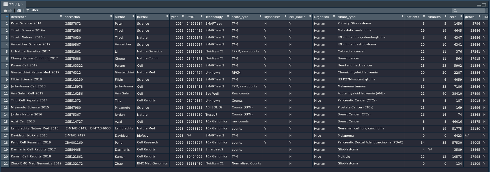

# TMExplorer

### Installation
``` 
library(devtools)
install_github("shooshtarilab/TMExplorer")
```
note: while the repo is set to private you will have to generate a personal access token (with repo access) [here](https://github.com/settings/tokens), make sure to save the token somewhere locally and then call:

`install_github("shooshtarilab/TMExplorer", auth_token='token')`

## Tutorial

### Exploring available datasets

Start by exploring the available datasets through metadata.

```
res = queryTME(metadata_only = TRUE)
```

This will return a list containing a single dataframe of metadata for all available datasets. View the metadata with `View(res[[1]])` and then check `?queryTME` for a description of searchable fields.

Note: in order to keep the function's interface consistent, `queryTME` always returns a list of objects, even if there is only one object. You may prefer running `res = queryTME(metadata_only = TRUE)[[1]]` in order to save the dataframe directly.



The `metatadata_only` argument can be applied alongside any other argument in order to examine only datasets that have certain qualities. You can, for instance, view only breast cancer datasets by using 

```
res = queryTME(tumour_type = 'Breast cancer', metadata_only = TRUE)
```
#### TODO add screenshot

### Getting your first dataset

Once you've found a field to search on, you can get your data. 

```
res = queryTME(geo_accession = "GSE72056")
```

This will return a list containing dataset GSE72056. The dataset is stored as a `tme_data` object, which has the following attributes:

#### TODO add screenshot

| Attribute     | Description |
| ------------- | ------------- |
| expression    | A `data.frame` containing genes x cells  |
| labels        | A `data.frame` containing a list of cell barcodes and their true cell-types |
| signatures    | A `data.frame` containing the cell types and a list of genes that represent that cell type |
| cells         | The number of cells included in the study |
| genes         | The number of genes included in the study |
| pmid          | The PubMed ID of the study |
| technology    | The sequencing technology used |
| score_type    | The type of score shown in `tme_data$expression` |
| organism      | The type of organism from which cells were sequenced |
| author        | The first author of the paper presenting the data |
| tumour_type   | The type of tumour sequenced |
| patients      | The number of patients included in the study |
| tumours       | The number of tumours sampled by the study |
| geo_accession | The GEO accession ID for the dataset |

### Example: Returning all datasets with cell-type labels

Say you want to measure the performance of cell-type classification methods. To do this, you need datasets that have the true cell-types available. 
```
res = queryTME(has_truth = TRUE)
```
This will return a list of all datasets that have true cell-types available. You can see the cell types for the first dataset using the following command:
```
View(res[[1]]$labels)
```


The first column of this dataframe contains the cell barcode, and the second contains the cell type. 

### Example: Returning all datasets with cell-type labels and cell-type gene signatures

Some cell-type classification methods require a list of gene signatures, to return only datasets that have cell-type gene signatures available, use:
```
res = queryTME(has_truth = TRUE, has_signatures = TRUE)
```

